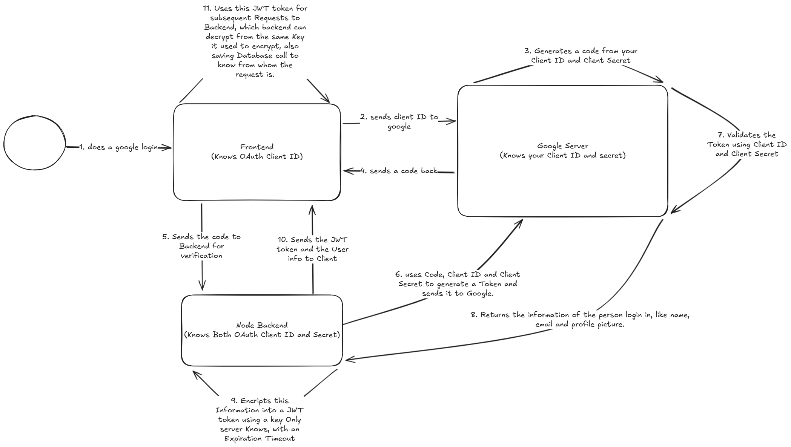

# This Repository acts as a Template for Google Oauth to be used in Multiple Projects


1. Needs Docker to be installed.
2. Spawns `React Frontend` and `Node Backend` in Separate Docker Containers.
3. It takes a .env in root directory with these values.

```
BACKEND_PORT=<your_value>
CORS_ORIGIN=<your_value>
OAUTH_CLIENT_ID=<your_value>
OAUTH_CLIENT_SECRET=<your_value>
FRONTEND_PORT=<your_value>
JWT_TOKEN_TIMEOUT=<your_value>
JWT_SECRET=<your_value>
```

4. Command to run - `docker-compose up --build`

